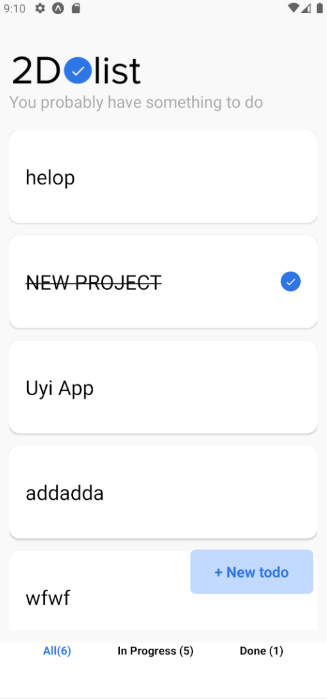
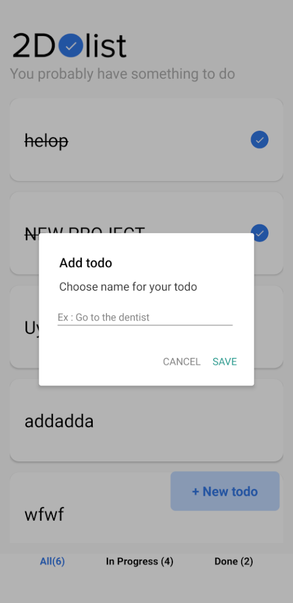

# To do List

## Features

The application allows you to:

- Create Tasks that must be completed
- Track The completion of tasks
- Mark tasks as either completed or incomplete
- Delete tasks by pressing and holding a task
- Asynchronous React Native storage for data persistance

## Run the APP

- git clone https://github.com/your-username/yarn-expo-project.git
- yarn install
- yarn start
